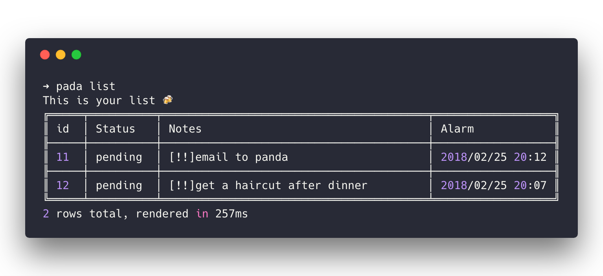
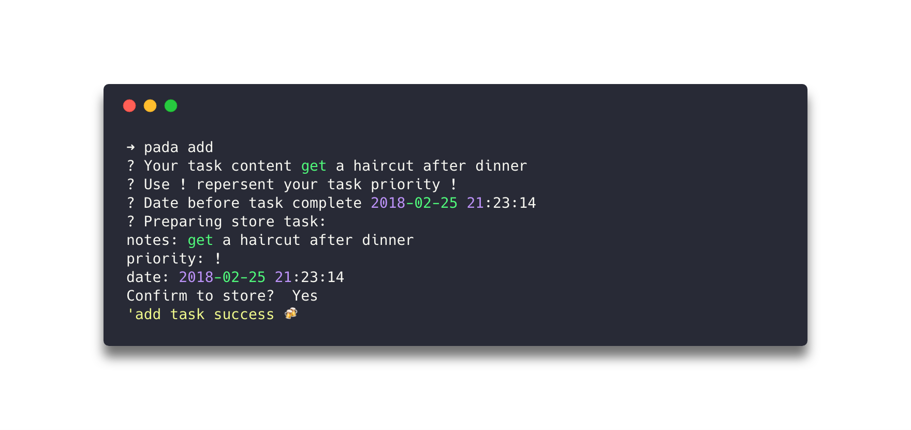
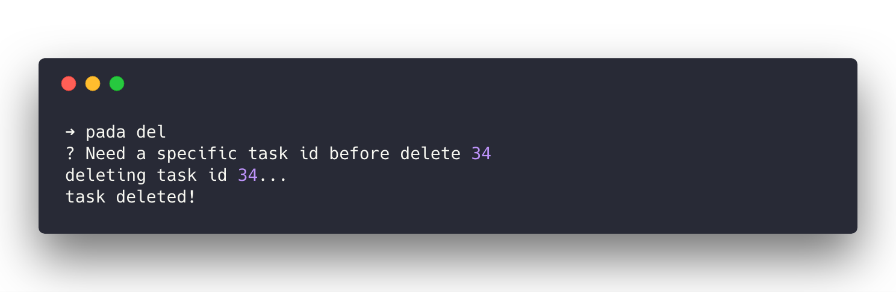

<h1 align="center">
  
</h1>

> Pada💥is a terminal version todo list.

## Why named Pada?

Simply because pada sounds good!

## What can I do with Pada?

terminal sweet terminal📮

Crud your todo list without leaving your sweet terminal😌

## Usage

  Usage: pada [options] [command]

  Options:

    -v, --version  output the version number
    -h, --help     output usage information

  Commands:

    list|ls     list all your tasks
    add|a       add a task in your list
    del|d       delete a task from you tasklist
    help [cmd]  display help for [cmd]

## Print Task List

    Usage: pada list || pada ls

<!-- [pada-list](./docs/pada-list.png) -->

## Create a Task

    Usage: pada add || pada a

<!-- [pada-add](./docs/pada-add.png) -->

## Delete a Task

    Usage: pada del [options] | pada d [options]

  Options:

    -a, --all  delete all tasks from database
    -h, --help  output usage information

<!-- [pada-add](./docs/pada-del.png) -->

## License

MIT
